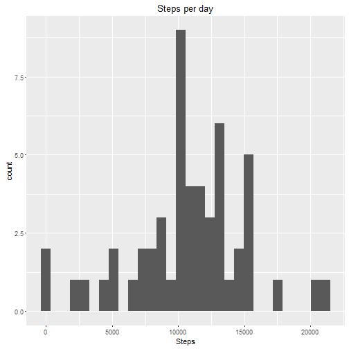
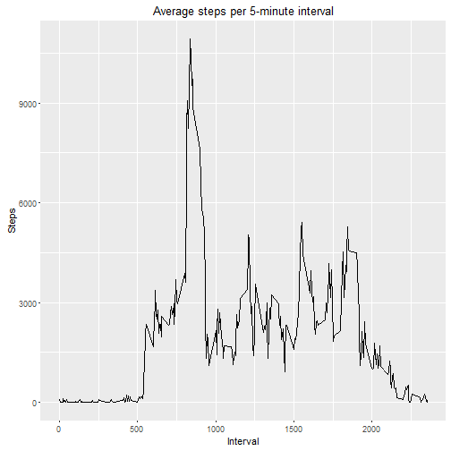
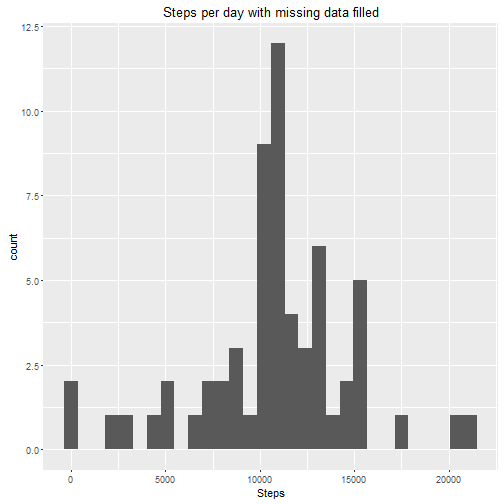
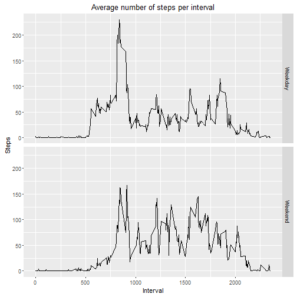

# Course project


1. Load libraries, read the data, correct date format


```r
library(ggplot2)
library(dplyr)
Adata<-read.csv("activity.csv")
Adata$date<-as.Date(Adata$date)
```


2. Group and plot the data
Filter NA´s so they dont disturb the median and mean data


```r
Mdata<-Adata %>% filter(is.na(steps)==FALSE) %>% group_by(date) %>% summarise(steps = sum(steps))
ggplot(data=Mdata,aes(x=Mdata$steps)) + xlab("Steps") + ggtitle("Steps per day") + geom_histogram(bins=30)
```




3. Mean and median of steps


```r
mean(Mdata$steps)
```

```
## [1] 10766.19
```

```r
median(Mdata$steps)
```

```
## [1] 10765
```


4. Here we plot a time series of the average steps taken per interval across days.


```r
Bdata<-Adata %>% filter(is.na(steps)==FALSE) %>% group_by(interval) %>% summarise(steps = sum(steps))
ggplot(data=Bdata,aes(x=Bdata$interval,y = Bdata$steps, group = 1)) + xlab("Interval") + ylab("Steps") + ggtitle("Average steps per 5-minute interval") + geom_line()
```




5. Here we show the 5-minute interval that, on average, contains the maximum number of steps


```r
Ndata<-Adata %>% filter(is.na(steps)==FALSE) %>% group_by(interval) %>% summarise(steps = mean(steps))
Ndata[Ndata$steps==max(Ndata$steps),][[1]]
```

```
## [1] 835
```


6. Now we work with missing data  


```r
count(Adata[is.na(Adata[,1]),])[[1]]
```

```
## [1] 2304
```

To generate missing data, we use the mean number of steps for each interval taken from the other days. The results aren´t round numbers, but if we use the median values we risk skewing the amount of steps taken.


```r
filleddata<-Adata
filleddata[(is.na(filleddata$steps)==TRUE),][,1]<-Ndata[match(filleddata[(is.na(filleddata$steps)==TRUE),][,3],Ndata$interval),2]
```


7. Now we replot our histogram with the added values


```r
MFdata<-filleddata %>% filter(is.na(steps)==FALSE) %>% group_by(date) %>% summarise(steps = sum(steps))
ggplot(data=MFdata,aes(x=MFdata$steps)) + xlab("Steps") + ggtitle("Steps per day with missing data filled") + geom_histogram(bins=30)
```



Now we see the median and mean of the new dataset with filled values. Obviously the mean is not affected by this, but the median is also the mean, because changing all of the missing values to the mean is enough to move it.


```r
mean(MFdata$steps)
```

```
## [1] 10766.19
```

```r
median(MFdata$steps)
```

```
## [1] 10766.19
```


8. We go back to working with our unaltered dataset.  
The next plot will compare the average number of steps taken per interval across weekdays and weekends


```r
filleddata[,4]<-as.factor(ifelse(as.POSIXlt(filleddata$date)$wday>=1 & as.POSIXlt(filleddata$date)$wday<=5,"Weekday","Weekend"))
colnames(filleddata)[4]<-"Weekday"
weekdaydata<-filleddata %>% filter(is.na(steps)==FALSE) %>% group_by(interval,Weekday) %>% summarise(steps = mean(steps))
ggplot(data=weekdaydata, aes(x=interval,y=steps)) + facet_grid(Weekday~.) + xlab("Interval") + ylab("Steps") + ggtitle("Average number of steps per interval")  + geom_line()
```



